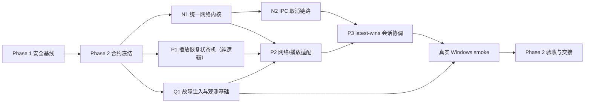

# Windows Phase 2 执行计划

> 状态：待执行  
> 平台范围：仅 Windows  
> 主题：统一网络可靠性、可取消请求、播放恢复与 latest-wins 会话协调  
> 前置条件：Phase 1 安全基线完成验收，并保留其 sandbox、IPC、凭据保护、同源认证和 CSP 边界。

## 1. 参考项目与许可证边界

参考项目采用 **AGPL-3.0**。Phase 2 只把它作为行为和架构层面的研究材料：

- 可以分析用户可见行为、职责拆分、故障恢复顺序和测试思路。
- 不复制、改写或移植参考项目的代码、资源、文本、测试数据及实现细节。
- 所有接口、状态机、错误模型、测试夹具和实现均在本项目中独立设计。
- 提交和阶段交接文档需记录设计依据、测试结果及与参考项目不同的实现选择，确保可追溯。

## 2. Phase 2 目标

Phase 2 要让 Windows 端在网络抖动、快速切集、临时播放地址失效及播放器启动失败时表现可预测、可恢复、可取消、可观测。

核心目标：

1. 建立统一网络内核，统一超时、取消、错误分类、重试和响应解析。
2. 打通 renderer → preload → main → backend 的请求取消链路。
3. 将播放恢复从零散条件分支收敛为可测试的有限状态机。
4. 将不同播放意图从“全部排队执行”调整为 **latest-wins**，只有最后一次有效意图能提交会话。
5. 建立脱敏的结构化事件和故障注入测试，能够复现并定位恢复过程。
6. 保留当前已有的线路健康检测、同键去重、Range 探测、Emby 会话上报和 Qt/mpv 播放能力。
7. 每个子阶段都生成 `docs/AI_HANDOFF/` 交接文档，并以独立提交形成可回滚边界。

## 3. 非目标

Phase 2 明确不做以下工作：

- 不支持或打磨 macOS、Linux、Android、iOS、Tauri 等其他端。
- 不创建统一 Source Backend/Registry，不重写 Local、WebDAV、Alist 浏览页面。
- 不引入跨来源 `MediaIdentity`、本地观看历史或远程进度 outbox。
- 不改造为分段下载，不新增下载 manifest、校验合并或剧集下载分组。
- 不重做播放器 UI、媒体详情页、主题系统或大范围视觉设计。
- 不一次性替换所有网络调用；采用 Emby → WebDAV → Alist → 播放解析的渐进接入顺序。
- 不对现有持久化状态做破坏性 schema 迁移。
- 不通过扩大 preload 或通用 IPC 能力面来实现取消。
- 不对非幂等请求进行无条件自动重试。
- 不复制参考项目实现。

## 4. 设计原则与不变量

### 4.1 网络不变量

- 用户取消后不得重试，也不得把取消显示为网络故障。
- 默认只重试明确允许的幂等操作；POST/会话上报等操作必须由调用点显式声明策略。
- 已收到服务端响应的非幂等请求不得因解析失败而盲目重放。
- 超时、取消、断网、鉴权、限流、服务端错误、客户端错误和解析错误必须可区分。
- 每次请求都必须在完成、失败、取消、sender 销毁时释放计时器和注册表项。
- 日志不得包含 token、密码、Cookie、Authorization、完整敏感查询参数或完整认证 URL。

### 4.2 播放不变量

- 同一时刻只有一个 generation 有权提交 `currentPlaySession`。
- 被 supersede 的旧请求可以清理资源，但不能启动新播放器、覆盖 UI、上报新的 Playing 或成为当前会话。
- 每个已成功开始的旧 Emby 会话最多发送一次对应的 Stopped。
- 恢复必须有总预算、分阶段预算和明确终止条件，禁止无限循环。
- 恢复成功后尽量保留最后稳定进度、音轨、字幕轨、暂停状态和窗口状态。
- 只有错误类别与恢复动作匹配时才执行回退，例如解码错误才进入软件解码回退。
- 最终失败必须暴露稳定错误类别和已尝试动作，而不是只返回普通 `Error`。

## 5. 总体依赖图



允许 N1、P1、Q1 在接口冻结后并行实现。N2 依赖 N1 的取消错误语义；P2/P3 涉及高冲突文件，只能由单一集成人串行接入。

## 6. 工作包 N1：统一网络内核

### 6.1 目标

新增独立的 `electron/backend/network/` 领域目录，把协议无关能力从 Emby、WebDAV、Alist 和播放解析代码中抽离：

- 标准错误类型与错误归一化。
- 分阶段超时与外部 `AbortSignal`。
- 幂等性和重试策略。
- 指数退避、抖动及 `Retry-After` 支持。
- 安全的 JSON、文本和空响应解析。
- 响应体大小、内容类型和异常截断处理。
- 结构化、脱敏的请求事件。

### 6.2 建议模块边界

建议以新文件为主，最终名称可在合约冻结时微调：

```text
electron/backend/network/
  errors.mjs
  request-policy.mjs
  request.mjs
  retry.mjs
  response.mjs
  redaction.mjs
```

模块职责：

- `errors.mjs`：稳定错误码、可重试性、用户可见类别、原始 cause。
- `request-policy.mjs`：连接/首字节/总时限、最大尝试次数、幂等策略。
- `request.mjs`：组合内部超时信号和调用方信号，保证 cleanup。
- `retry.mjs`：退避、抖动、`Retry-After` 和预算计算。
- `response.mjs`：按预期内容安全解析并保留 HTTP 上下文。
- `redaction.mjs`：对 URL、headers、错误上下文和日志字段统一脱敏。

### 6.3 最小错误分类

错误模型至少覆盖：

- `cancelled`
- `timeout_connect`
- `timeout_response`
- `timeout_total`
- `network_unreachable`
- `connection_reset`
- `tls`
- `http_auth`
- `http_not_found`
- `http_rate_limit`
- `http_transient`
- `http_client`
- `invalid_response`
- `parse`
- `unknown`

每个错误至少包含：

- 稳定 `code`
- `category`
- 是否建议重试
- HTTP status（若存在）
- 当前 attempt 与最大 attempts
- 脱敏后的 endpoint/origin
- 原始 `cause`

### 6.4 重试规则

- GET/HEAD 默认可按策略重试；其他方法默认不重试。
- DELETE 即使语义上幂等，也必须由具体 API 显式启用。
- POST、播放会话 Start/Progress/Stopped、登录及配置写入默认不重试。
- 401/403 不自动重试，除非上层先完成凭据刷新或播放地址重新解析。
- 404 不自动重试。
- 429、502、503、504 可在预算内重试，并尊重合理的 `Retry-After`。
- 连接建立前失败可重试；服务端可能已接收请求时必须采用更保守策略。
- 取消、解析错误、无效 payload 不通过网络重试掩盖。
- 所有重试使用有限预算；测试中注入确定性随机源，避免不稳定测试。

### 6.5 渐进接入顺序

1. Emby 只读 GET/HEAD。
2. WebDAV 列表与只读资源请求。
3. Alist 列表、解析与只读资源请求。
4. 播放地址解析和线路探测。
5. 最后审计会话上报、认证和其他非幂等调用，逐调用点决定策略。

每完成一个适配器，都应保留兼容包装层，避免要求所有调用方同一提交内切换。

## 7. 工作包 N2：IPC 取消链路

### 7.1 目标

renderer 侧能够通过 `AbortSignal` 主动取消仍在 main/backend 执行的请求。页面离开、快速搜索、切换服务器和新播放意图出现时，不再等待旧请求自然超时。

### 7.2 建议协议

1. renderer/platform 层为每次可取消调用生成不可预测或单调唯一的 `requestId`。
2. preload 只暴露受限的可取消调用和 cancel 方法，不暴露任意 channel。
3. main 按 `requestId` 创建 `AbortController` 并登记：
   - sender/webContents
   - frame 身份
   - command
   - 创建时间
4. cancel IPC 必须验证请求所有者、可信主 frame 和 requestId 格式。
5. 请求结束、失败、取消、窗口销毁或导航离开后统一删除登记。
6. backend 接收 `AbortSignal`，N1 将其转换为稳定的 `cancelled` 错误。
7. renderer 即使已发送取消，也必须保留 generation guard，防止“取消与完成同时发生”时旧响应覆盖新状态。

### 7.3 安全边界

- 不扩大现有通用 `hillsLite.invoke` 的可调用命令集合。
- 不允许一个窗口取消另一个窗口的请求。
- 不接受 renderer 自报的 sender/frame 身份。
- request registry 设置数量上限和存活上限，防止泄漏或滥用。
- 取消操作本身必须幂等。

### 7.4 首批接入场景

- 搜索与媒体列表加载。
- 详情页加载和快速切换。
- WebDAV/Alist 目录浏览。
- 播放源解析与线路探测。
- latest-wins 产生的新播放意图。

会话上报等副作用操作不应仅凭 UI 离开就任意中断，需由会话协调器决定。

## 8. 工作包 P1/P2：播放恢复状态机

### 8.1 纯逻辑状态机

先在新文件中实现不依赖 BrowserWindow、Qt、mpv 或真实网络的纯状态机，再由集成人接入 `electron/main.mjs`。

建议状态：

```text
idle
resolving
starting
playing
recovering_re_resolve
recovering_reload
recovering_switch_source
recovering_software_decode
recovering_recreate
superseded
cancelled
failed
stopped
```

建议新增：

```text
electron/backend/playback/
  recovery-errors.mjs
  recovery-policy.mjs
  recovery-machine.mjs
  session-coordinator.mjs
```

### 8.2 恢复输入

状态机只接收明确事件，不直接操作进程：

- resolve 成功/失败
- player load 成功/失败
- 播放器退出及退出类别
- HTTP/签名地址错误
- 解码错误
- stall/无进度
- 用户 stop
- 外部 cancel
- 新 generation supersede
- 恢复动作成功/失败

### 8.3 建议恢复顺序

恢复动作不是固定全部执行，而是由错误类别和剩余预算选择：

1. **重新解析临时播放地址**：适用于签名 URL 过期、明确 401/403 或解析器声明可刷新。
2. **同一播放器原地 reload**：回到最后稳定位置并恢复轨道。
3. **切换备用线路或媒体来源**：只使用已通过安全及协议校验的候选。
4. **软件解码回退**：仅用于明确解码/硬件初始化错误。
5. **有限次数重建播放器进程**：清理旧进程后恢复位置与轨道。
6. **最终失败**：返回错误类别、最后阶段、尝试历史和用户可执行建议。

### 8.4 预算

策略应集中配置，初始建议：

- 单动作最多 1–2 次。
- 单次播放恢复总动作不超过 4 次。
- 短时间连续失败触发冷却，禁止进程重建风暴。
- 用户主动切集、停止或关闭窗口立即终止旧 generation 的恢复。

具体数值必须通过故障注入和真实 Windows smoke 调整，不散落在业务代码中。

### 8.5 位置与轨道恢复

协调器维护：

- 最后稳定播放位置。
- 当前播放/暂停状态。
- 音轨、字幕轨和字幕延迟。
- 当前线路/媒体来源。
- 已尝试的恢复动作。

只在收到可信播放进度后更新稳定位置。恢复后的进度应允许小幅回退以避免跳过内容，但不得回到零或大幅前跳。

## 9. 工作包 P3：latest-wins 会话协调

### 9.1 问题定义

当前同键请求可去重，但不同剧集、版本或来源可能按队列依次执行。快速连续点击时，旧请求仍可能创建会话、启动播放器或覆盖最终状态。

### 9.2 目标行为

- 每个播放意图获得递增 `generation`。
- 新 generation 立即使未开始的旧请求失效，并取消可取消的旧解析。
- 已进入副作用阶段的旧请求转入受控清理，不再有提交权。
- 只有当前 generation 可：
  - 设置 `currentPlaySession`
  - 启动或接管播放器窗口
  - 发布 Playing/恢复成功事件
  - 覆盖 renderer 当前播放状态
- 对完全相同且仍有效的请求保留现有去重能力。
- 快速连续选择十次剧集时，最终只允许最后一次选择对应一个有效播放器和一个当前会话。

### 9.3 会话提交点

将“解析完成”“播放器已加载”“会话成为当前会话”分开。任何异步边界后都重新检查 generation：

```text
intent accepted
  -> source resolved
  -> player prepared
  -> generation still current
  -> session committed
  -> Playing reported
```

未通过 generation 检查的操作只执行幂等清理，不得继续提交。

### 9.4 Stop/Stopped 语义

- 尚未成功 Start 的 superseded 请求不发送虚假的 Stopped。
- 已成功 Start 的会话在被替代时发送一次 Stopped。
- Stop 失败要记录到脱敏事件中，但不能使新 generation 永久等待。
- 进度上报必须绑定 session ID 和 generation，旧定时器不得向新会话写入。

## 10. 工作包 Q1：故障注入与可观测性

### 10.1 结构化事件

建议统一事件字段：

- `correlationId`
- `requestId`
- `generation`
- `sessionId`（允许脱敏或短 ID）
- `phase`
- `attempt`
- `maxAttempts`
- `errorCategory`
- `recoveryAction`
- `elapsedMs`
- `sourceKind`
- 脱敏 origin
- `result`

禁止记录：

- token、密码、Cookie、Authorization。
- 完整自定义 headers。
- 带 userinfo 或敏感查询参数的 URL。
- 可还原凭据的请求/响应 body。

### 10.2 用户可见状态

只暴露少量稳定状态，避免把内部堆栈直接显示给用户：

- 正在重新连接
- 正在刷新播放地址
- 正在切换线路
- 正在回退软件解码
- 正在恢复播放
- 恢复失败

### 10.3 故障注入能力

测试必须能够无真实服务器地注入：

- DNS/连接失败。
- 建连后断开。
- 首字节和响应体超时。
- 401/403、429、502、503、504。
- `Retry-After`。
- 无效 JSON、截断 body、错误 content type。
- 取消与响应完成竞态。
- 临时播放 URL 失效。
- 播放器加载失败、异常退出、stall。
- 软件解码成功/失败。
- 备用线路成功/失败。
- sender/window 销毁。

故障时钟、随机源、网络适配器、解析器和播放器适配器均应可注入，保证测试快速且确定。

## 11. 并行执行与文件所有权

### 11.1 并行原则

- 优先新增领域文件，减少多人同时修改大型文件。
- 高冲突文件只允许指定集成人修改。
- 只读审查代理不得顺手修改代码。
- 实现代理应使用隔离 worktree；若环境不支持，必须严格遵守文件所有权。
- 代理完成后提交变更清单、测试结果和未解决风险，由集成人审查后接入。
- 不使用无边界的 `git add .`，不覆盖或清理所有权不明的工作区变化。

### 11.2 推荐并行泳道

| 泳道 | 工作包 | 可写范围 | 禁止直接修改 |
|---|---|---|---|
| A | N1 网络内核 | `electron/backend/network/**`、对应独立测试文件 | `electron/main.mjs`、现有 connector |
| B | P1 恢复状态机 | `electron/backend/playback/recovery-*.mjs`、纯逻辑测试 | `electron/main.mjs`、`src/stores/player.ts` |
| C | Q1 故障注入/日志测试 | 新增测试夹具、mock server、独立检查脚本 | 生产集成文件 |
| D | N2 取消协议设计/实现 | 新增取消注册表模块和独立测试 | preload/main/platform/API 由集成人接线 |
| E | 安全/并发审查 | 只读 | 全部文件 |
| I | 集成 | 下列高冲突文件及适配器接线 | 不接收未通过单元门禁的工作包 |

### 11.3 集成人独占文件

以下文件在 Phase 2 集成期间只允许一个代理写入：

- `electron/main.mjs`
- `electron/preload.cjs`
- `src/platform/index.ts`
- `src/api/index.ts`
- `src/stores/player.ts`
- `src/types/models.ts`
- `package.json`

Emby、WebDAV、Alist 现有 backend 文件按接入顺序逐个分配独占权，不并行修改同一 connector。

### 11.4 推荐阶段

| 阶段 | 并行内容 | 收口条件 | 交接文档 |
|---|---|---|---|
| 2A | N1、P1、Q1 | 纯逻辑与假网络测试通过，接口冻结 | `docs/AI_HANDOFF/PHASE_2A_*.md` |
| 2B | N2、Emby/WebDAV/Alist 渐进适配 | 取消传播和错误兼容通过 | `docs/AI_HANDOFF/PHASE_2B_*.md` |
| 2C | P2、P3 单集成人接入 | latest-wins、有限恢复通过 | `docs/AI_HANDOFF/PHASE_2C_*.md` |
| 2D | Windows 构建、真实 smoke、审查 | 无阻塞问题，残余风险已记录 | `docs/AI_HANDOFF/PHASE_2_*.md` |

## 12. 验收命令

命令以 Windows PowerShell 为基准。现有门禁必须继续通过：

```powershell
npm.cmd run check:secure-credentials
npm.cmd run check:electron-security
npm.cmd run check:electron-commands
npm.cmd run check:local-decode
npm.cmd run check:no-planned-ui
.\node_modules\.bin\vue-tsc.cmd --noEmit
npm.cmd run build
node scripts/smoke-webdav-connector.mjs
node scripts/smoke-alist-connector.mjs
node scripts/smoke-electron-remote-poster-proxy.mjs
git diff --check
```

Phase 2 实现必须新增并接入生产构建门禁的等价检查；建议命令名称：

```powershell
npm.cmd run check:network-policy
npm.cmd run check:ipc-cancellation
npm.cmd run check:playback-recovery
npm.cmd run check:playback-latest-wins
npm.cmd run check:phase2-observability
```

上述新增命令的最低覆盖要求：

- GET 瞬态故障按预算重试，POST 默认不重试。
- `Retry-After`、取消、所有超时类别和 timer cleanup。
- sender 销毁后请求注册表为空。
- 取消与完成竞态只结算一次。
- 状态机所有终态、预算耗尽和错误类别映射。
- 十次快速播放意图最终仅最后一个 generation 提交。
- superseded 会话的 Start/Stopped 次数正确。
- 日志脱敏断言覆盖 URL、headers、body 和嵌套 cause。

提交前对所有 Phase 2 新增或修改的 `.mjs/.cjs` 文件执行 `node --check`，并在无其他代理写入的稳定快照上重跑完整门禁。

## 13. 真实 Windows smoke

自动化通过后，必须在真实 Windows Electron 构建上执行，不能只使用 fake provider、旧 `app.asar` 或无落盘 Vite build。

### 13.1 构建与基础运行

- 生成当前代码对应的新 Electron unpacked/package 产物。
- 确认 sandbox、`preload.cjs`、CSP、可信 IPC 和外链拦截仍有效。
- 使用独立 userData，避免个人正式配置干扰。
- 冷启动、热重启、窗口关闭和播放器进程清理均无残留。

### 13.2 网络 smoke

- 本地可控 HTTP 服务分别模拟延迟、断连、401/403、429、503、无效 JSON 和截断响应。
- 页面离开或切换筛选时旧请求在 backend 真实终止。
- 连续搜索、连续切服务器后没有旧结果回写、未处理 Promise 或请求注册表泄漏。
- 断网后恢复网络，允许重试的读取请求能恢复；非幂等请求不重复提交。
- WebDAV/Alist/Emby 的认证头仍遵守 Phase 1 同源边界。

### 13.3 播放恢复 smoke

- 正常 Emby、WebDAV、Alist 播放各至少一次。
- 模拟临时 URL 过期：重新解析后从接近原位置恢复。
- 模拟当前线路失败：只在预算内切换到健康备用线路。
- 模拟硬件解码初始化失败：仅此类别触发软件解码回退。
- 模拟播放器异常退出：有限重建，不出现进程风暴。
- 恢复后验证音轨、字幕轨、暂停状态和进度。
- 所有恢复动作失败时，用户看到稳定错误，日志包含阶段与类别但无凭据。

### 13.4 latest-wins smoke

- 在同一详情页快速连续选择十个不同剧集/版本。
- 验证最终只剩最后一次选择对应的一个有效播放器进程和一个当前会话。
- 旧 generation 不得闪回、夺取窗口、覆盖标题/进度或继续上报。
- 已 Start 的旧会话只发送一次 Stopped；未 Start 的请求不发送虚假 Stopped。
- 在 resolving、starting、recovering 各阶段分别触发 supersede。
- 快速点击同一项目仍保持合理去重，不产生多播放器。

### 13.5 稳定性 smoke

- 连续执行至少 50 次搜索/取消和 20 次快速切集。
- 播放中断网、恢复网络、关闭窗口、退出应用。
- 检查 Electron、Qt/mpv 子进程、计时器和 request registry 均被释放。
- 检查播放日志和应用日志，确认没有 token、Cookie、Authorization 或敏感 URL 参数。

## 14. 验收判定

Phase 2 只有同时满足以下条件才能完成：

- 所有现有门禁与 Phase 2 新门禁在最终稳定快照上通过。
- 真实 Windows smoke 完成并记录版本、构建产物、步骤和结果。
- 没有阻塞级或高风险未处理问题。
- 中风险问题要么修复，要么有明确理由、影响、临时保护和后续阶段。
- 快速连续播放满足 latest-wins，不再顺序启动所有旧意图。
- 恢复状态机无无限循环，所有终态可测试。
- 取消链路无跨窗口取消、注册表泄漏或旧响应覆盖。
- 结构化日志通过凭据脱敏审计。
- 阶段文档列出完整变更文件、提交、测试 PASS/FAIL/SKIPPED、回滚方式和残余风险。
- 当前阶段提交已推送到 GitHub 对应 `codex/` 分支。

## 15. 回滚边界

Phase 2 不做破坏性数据迁移，回滚应以代码提交为主。

### 15.1 建议提交边界

1. **N1 contracts/tests**：错误类型、策略、纯测试，不接业务流量。
2. **N1 adapters**：按 Emby、WebDAV、Alist 分开提交。
3. **N2 cancellation core**：注册表和协议测试。
4. **N2 integration**：preload/platform/API/main 接线。
5. **P1 recovery machine**：纯状态机与测试。
6. **P2 playback integration**：播放器适配和恢复动作。
7. **P3 latest-wins**：generation/session coordinator。
8. **Q1 gates/docs**：故障注入、日志门禁、Windows 验收文档。

### 15.2 回滚策略

- 新模块在接线前保持无副作用，可单独回滚。
- connector 适配失败时，只回滚对应 connector 提交，不回滚已验证的网络内核。
- N1 保留兼容错误包装，使旧调用方在渐进迁移期间仍得到原有用户提示。
- N2 可取消能力出现问题时，可回滚接线提交；renderer generation guard 必须保留。
- 播放恢复和 latest-wins 接入前保留清晰的 legacy 入口，验收完成后再移除；禁止长期维护两套并行实现。
- 集成提交不得混入持久化 schema、UI 大改或下载改造，以保证可精确撤销。
- 若恢复动作造成会话或播放器进程异常，优先关闭对应恢复动作并回到“明确失败”，不得用无限重试掩盖。
- 回滚后必须重跑安全、IPC、类型、构建和基础播放门禁。

## 16. Phase 3 延后项

以下差距已确认，但全部延后到 Phase 3：

1. **统一来源层**
   - Source Backend/Registry。
   - Local、WebDAV、Alist 适配器。
   - 共享浏览、搜索、排序和错误 UI。

2. **媒体身份与历史**
   - 跨来源 `MediaIdentity`。
   - 本地 start/progress/stop/complete 事件日志。
   - 离线观看历史和续播。
   - 远程进度持久化 outbox 与补偿回写。

3. **下载可靠性**
   - 下载 manifest 和 Range 探测模型。
   - 分段执行器。
   - 校验、原子合并和失败回滚。
   - 稳定任务身份、重复保护、剧集元数据和分组 UI。

4. **其他平台**
   - Tauri 及非 Windows 平台适配。

Phase 2 可以为 Phase 3 提供网络错误模型、取消协议和观测基础，但不得借机提前扩张 Phase 3 数据模型或 UI 范围。

## 17. Phase 2 完成定义

用户在 Windows 端快速搜索、切换详情、连续选集或遇到临时网络/播放故障时：

- 旧操作可被真实取消。
- 只有最后一次播放意图生效。
- 可恢复错误按有限策略自动恢复。
- 不可恢复错误明确结束并可定位。
- 不泄露凭据，不破坏 Phase 1 安全边界。
- 应用重启和阶段中断后，其他 AI 能通过 `docs/AI_HANDOFF/`、提交历史和本计划继续工作。
